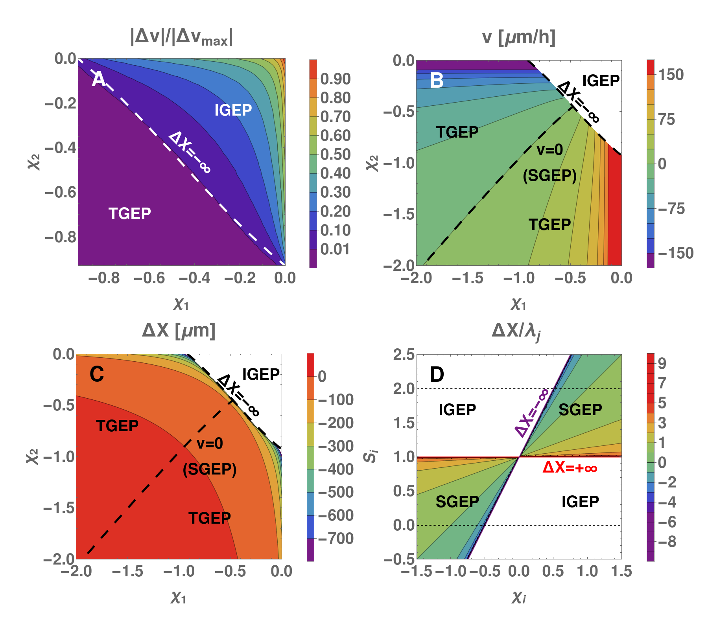
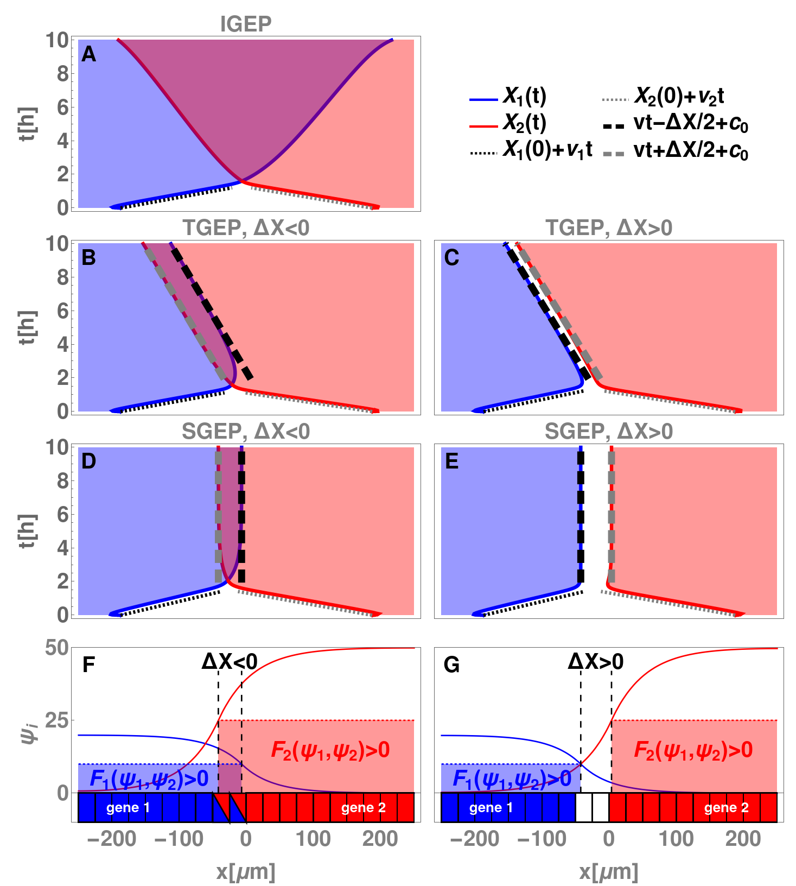
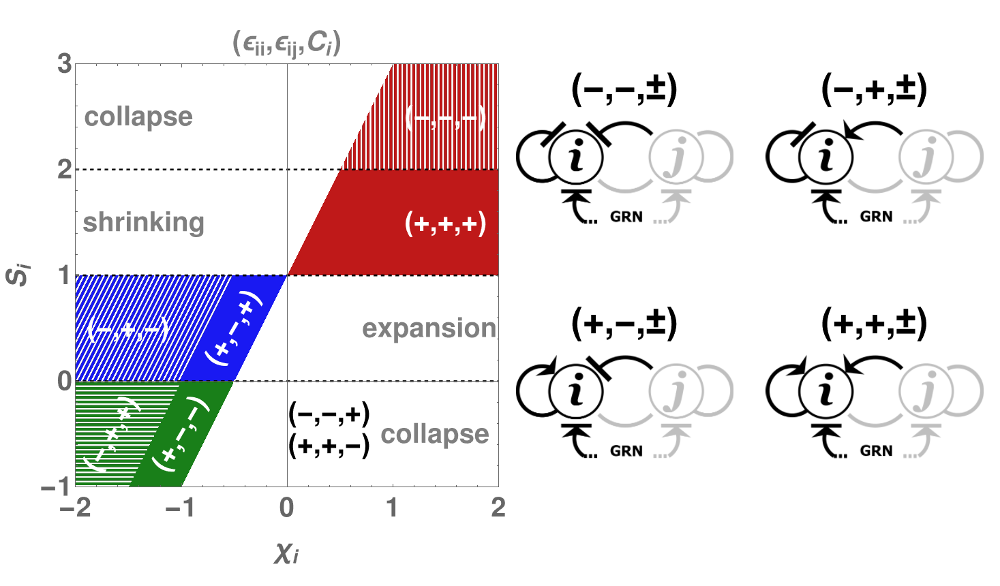

# Plots for the project on Gene Expression Patterns dynamics

Here, you can find the code I wrote to generate the plots for my work on gene expression patterns. Checkout [this article](https://arxiv.org/pdf/2206.14138.pdf) for the context and explainations. GitHub is not very Mathematica-friendly, so in `GEP_plots_code.pdf` you can read the code in a human-friendly form (though, graphics suffers from some export glitches), while `GEP_plots_code.nb` is the actual notebook.

 
   

 
   

