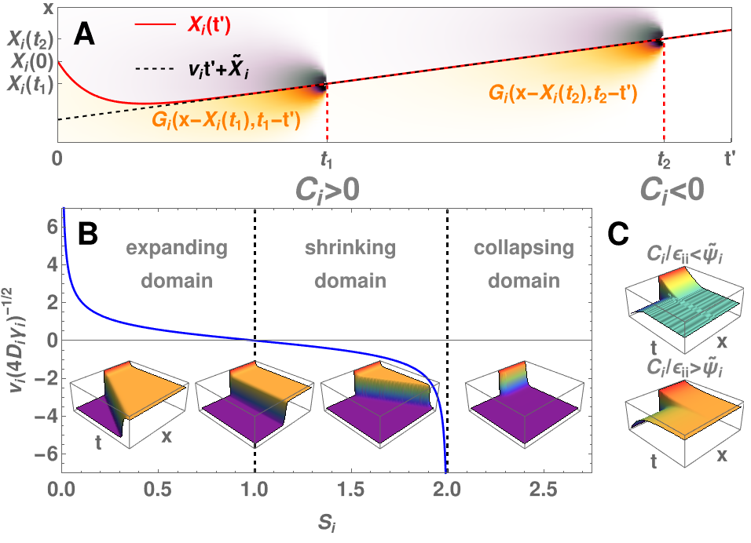

# Plots for the project on Gene Expression Patterns dynamics

Here, you can find the code I wrote to generate the plots for my work on gene expression patterns. Checkout the original [article](https://journals.aps.org/prl/abstract/10.1103/PhysRevLett.130.098402) (or its [free preprint](https://arxiv.org/pdf/2206.14138.pdf)) for the context and explainations or the actual article was published in . GitHub is not very Mathematica-friendly, so in `GEP_plots_code.pdf` you can read the code in a human-friendly form (though, graphics suffers from some export glitches), while `GEP_plots_code.nb` is the actual notebook.

 
   

 
   

